# UE程序启动流程分析

## 概述

本文档详细分析了Unreal Engine程序的启动流程，包括地图、游戏实例、游戏模式、关卡、控制器、Pawn、Actor以及SLLua的加载顺序。

## 启动流程详解

### 1. 游戏实例（GameInstance）初始化

**时机**: 程序启动时最早创建

**流程**:
- `UMyGameInstance::UMyGameInstance()` - 构造函数
  - 创建LuaState (`CreateLuaState()`)
  - 设置Lua文件加载委托 (`setLoadFileDelegate`)
  - 初始化LuaState (`state->init()`)
  - 加载初始Lua文件 (`state->doFile("helloworld")`)
- `UMyGameInstance::Init()` - 游戏实例初始化

**关键代码位置**:
- `Source/LuaDemo/MyGameInstance.cpp`
- `Source/LuaDemo/MyGameInstance.h`

### 2. 地图（Map）加载

**时机**: GameInstance初始化后

**流程**:
- 引擎根据配置加载默认地图
- 配置文件: `Config/DefaultEngine.ini`
  - `GameDefaultMap=/Game/FirstPersonBP/Maps/FirstPersonExampleMap`
  - `GameInstanceClass=/Script/LuaDemo.MyGameInstance`

### 3. 游戏模式（GameMode）创建

**时机**: 地图加载后

**流程**:
- 引擎创建GameMode实例
- `AAdventureGameMode::AAdventureGameMode()` - 构造函数
- `ALuaGameMode::PostInitializeComponents()` (如果使用LuaGameMode)
  - 调用 `ILuaOverriderInterface::PostLuaHook()`
  - 加载GameMode对应的Lua文件
- `AAdventureGameMode::StartPlay()` - 开始游戏

**关键代码位置**:
- `Source/LuaDemo/AdventureGameMode.cpp`
- `Plugins/slua_unreal/Source/slua_unreal/Private/LuaGameMode.cpp`

### 4. 玩家控制器（PlayerController）创建

**时机**: GameMode创建后，在StartPlay之前

**流程**:
- GameMode创建PlayerController
- `ALuaPlayerController::ALuaPlayerController()` - 构造函数
- `ALuaPlayerController::PostInitializeComponents()`
  - 调用 `ILuaOverriderInterface::PostLuaHook()`
  - 加载PlayerController对应的Lua文件

**关键代码位置**:
- `Plugins/slua_unreal/Source/slua_unreal/Private/LuaPlayerController.cpp`

### 5. Pawn创建

**时机**: PlayerController创建后，通过GameMode::SpawnDefaultPawnFor创建

**流程**:
- `AAdventureCharacter::AAdventureCharacter()` - 构造函数
- `ALuaPawn::PostInitializeComponents()` (如果使用LuaPawn)
  - 调用 `ILuaOverriderInterface::PostLuaHook()`
  - 加载Pawn对应的Lua文件

**关键代码位置**:
- `Source/LuaDemo/AdventureCharacter.cpp`
- `Plugins/slua_unreal/Source/slua_unreal/Private/LuaPawn.cpp`

### 6. Actor创建

**时机**: 地图加载时，关卡中的Actor被创建

**流程**:
- `ALuaActor::ALuaActor()` - 构造函数
- `ALuaActor::PostInitializeComponents()`
  - 调用 `ILuaOverriderInterface::PostLuaHook()`
  - 加载Actor对应的Lua文件

**关键代码位置**:
- `Plugins/slua_unreal/Source/slua_unreal/Private/LuaActor.cpp`

### 7. BeginPlay阶段

**时机**: 所有对象创建完成后，按顺序调用BeginPlay

**流程**:
1. `AGameMode::StartPlay()` - 游戏模式开始
2. `AActor::BeginPlay()` - Actor开始播放
3. `APawn::BeginPlay()` - Pawn开始播放
4. `APlayerController::BeginPlay()` - 控制器开始播放

**关键代码位置**:
- `Source/LuaDemo/AdventureCharacter.cpp` - `BeginPlay()`

## SLLua加载机制

### LuaState初始化流程

1. **创建LuaState**
   - 在GameInstance构造函数中创建
   - 设置文件加载委托
   - 初始化Lua虚拟机

2. **Lua文件加载时机**
   - GameInstance: 构造函数中加载 `helloworld.lua`
   - GameMode: `PostInitializeComponents()` 中通过 `PostLuaHook()` 加载
   - PlayerController: `PostInitializeComponents()` 中通过 `PostLuaHook()` 加载
   - Pawn: `PostInitializeComponents()` 中通过 `PostLuaHook()` 加载
   - Actor: `PostInitializeComponents()` 中通过 `PostLuaHook()` 加载

3. **PostLuaHook机制**
   - `ILuaOverriderInterface::PostLuaHook()` 调用 `_PostConstruct` Lua函数
   - `ILuaOverriderInterface::TryHook()` 通过 `LuaState::hookObject()` 绑定Lua表

**关键代码位置**:
- `Plugins/slua_unreal/Source/slua_unreal/Private/LuaOverriderInterface.cpp`
- `Plugins/slua_unreal/Source/slua_unreal/Private/LuaOverrider.cpp`

## 完整启动流程图

```mermaid
graph TD
    A[程序启动] --> B[GameInstance构造函数]
    B --> C[创建LuaState]
    C --> D[设置Lua文件加载委托]
    D --> E[初始化LuaState state->init]
    E --> F[加载helloworld.lua]
    F --> G[GameInstance::Init]
    G --> H[加载地图Map]
    H --> I[创建GameMode]
    I --> J[GameMode::PostInitializeComponents]
    J --> K[GameMode::PostLuaHook]
    K --> L[加载GameMode Lua文件]
    L --> M[创建PlayerController]
    M --> N[PlayerController::PostInitializeComponents]
    N --> O[PlayerController::PostLuaHook]
    O --> P[加载PlayerController Lua文件]
    P --> Q[GameMode::SpawnDefaultPawnFor]
    Q --> R[创建Pawn]
    R --> S[Pawn::PostInitializeComponents]
    S --> T[Pawn::PostLuaHook]
    T --> U[加载Pawn Lua文件]
    U --> V[创建关卡中的Actor]
    V --> W[Actor::PostInitializeComponents]
    W --> X[Actor::PostLuaHook]
    X --> Y[加载Actor Lua文件]
    Y --> Z[GameMode::StartPlay]
    Z --> AA[Actor::BeginPlay]
    AA --> AB[Pawn::BeginPlay]
    AB --> AC[PlayerController::BeginPlay]
    AC --> AD[游戏运行中]

    style B fill:#e1f5ff
    style C fill:#fff4e1
    style E fill:#fff4e1
    style F fill:#fff4e1
    style I fill:#e8f5e9
    style K fill:#fff4e1
    style M fill:#f3e5f5
    style O fill:#fff4e1
    style Q fill:#fce4ec
    style T fill:#fff4e1
    style W fill:#e0f2f1
    style X fill:#fff4e1
    style Z fill:#e8f5e9
```



## 详细时序图

```mermaid
sequenceDiagram
    participant Engine as UE引擎
    participant GI as GameInstance
    participant LS as LuaState
    participant Map as 地图
    participant GM as GameMode
    participant PC as PlayerController
    participant Pawn as Pawn
    participant Actor as Actor

    Engine->>GI: 创建GameInstance
    GI->>LS: 创建LuaState
    GI->>LS: 设置文件加载委托
    GI->>LS: init()
    GI->>LS: doFile("helloworld")
    LS-->>GI: Lua文件加载完成
    
    Engine->>GI: Init()
    Engine->>Map: 加载地图
    Map->>GM: 创建GameMode
    
    GM->>GM: PostInitializeComponents()
    GM->>LS: PostLuaHook()
    LS->>LS: 加载GameMode Lua文件
    
    GM->>PC: 创建PlayerController
    PC->>PC: PostInitializeComponents()
    PC->>LS: PostLuaHook()
    LS->>LS: 加载PlayerController Lua文件
    
    GM->>Pawn: SpawnDefaultPawnFor
    Pawn->>Pawn: PostInitializeComponents()
    Pawn->>LS: PostLuaHook()
    LS->>LS: 加载Pawn Lua文件
    
    Map->>Actor: 创建关卡Actor
    Actor->>Actor: PostInitializeComponents()
    Actor->>LS: PostLuaHook()
    LS->>LS: 加载Actor Lua文件
    
    GM->>GM: StartPlay()
    Actor->>Actor: BeginPlay()
    Pawn->>Pawn: BeginPlay()
    PC->>PC: BeginPlay()
```

## 关键函数调用顺序

### 1. GameInstance阶段
```
UMyGameInstance::UMyGameInstance()
  └─ CreateLuaState()
      ├─ new NS_SLUA::LuaState()
      ├─ setLoadFileDelegate()
      ├─ state->init()
      └─ state->doFile("helloworld")

UMyGameInstance::Init()
```

### 2. GameMode阶段
```
AAdventureGameMode::AAdventureGameMode()
ALuaGameMode::PostInitializeComponents()
  └─ ILuaOverriderInterface::PostLuaHook()
      └─ TryHook()
          └─ LuaState::hookObject()
              └─ 加载GameMode Lua文件

AAdventureGameMode::StartPlay()
```

### 3. PlayerController阶段
```
ALuaPlayerController::ALuaPlayerController()
ALuaPlayerController::PostInitializeComponents()
  └─ ILuaOverriderInterface::PostLuaHook()
      └─ TryHook()
          └─ LuaState::hookObject()
              └─ 加载PlayerController Lua文件
```

### 4. Pawn阶段
```
AAdventureCharacter::AAdventureCharacter()
ALuaPawn::PostInitializeComponents()
  └─ ILuaOverriderInterface::PostLuaHook()
      └─ TryHook()
          └─ LuaState::hookObject()
              └─ 加载Pawn Lua文件
```

### 5. Actor阶段
```
ALuaActor::ALuaActor()
ALuaActor::PostInitializeComponents()
  └─ ILuaOverriderInterface::PostLuaHook()
      └─ TryHook()
          └─ LuaState::hookObject()
              └─ 加载Actor Lua文件
```

### 6. BeginPlay阶段
```
AGameMode::StartPlay()
AActor::BeginPlay()
APawn::BeginPlay()
APlayerController::BeginPlay()
```

## 重要说明

1. **LuaState创建时机**: LuaState在GameInstance构造函数中创建，确保在整个游戏生命周期中可用。

2. **Lua文件加载**: 
   - GameInstance在构造函数中主动加载 `helloworld.lua`
   - 其他对象（GameMode、PlayerController、Pawn、Actor）通过 `PostLuaHook()` 机制在 `PostInitializeComponents()` 时加载对应的Lua文件

3. **PostInitializeComponents时机**: 
   - 在对象创建后、BeginPlay之前调用
   - 这是加载Lua文件的最佳时机

4. **BeginPlay顺序**: 
   - GameMode::StartPlay() 最先调用
   - 然后是Actor::BeginPlay()
   - 最后是Pawn和PlayerController的BeginPlay()

5. **Lua文件路径**: 
   - 默认从 `Content/Lua/` 目录加载
   - 文件名通过 `GetLuaFilePath()` 获取

## 配置文件

### DefaultEngine.ini
```ini
[/Script/EngineSettings.GameMapsSettings]
GameInstanceClass=/Script/LuaDemo.MyGameInstance
GameDefaultMap=/Game/FirstPersonBP/Maps/FirstPersonExampleMap
GlobalDefaultGameMode=/Game/FirstPersonBP/Blueprints/BP_AdventureGameMode.BP_AdventureGameMode_C
```

## 相关文件

- `Source/LuaDemo/MyGameInstance.cpp` - 游戏实例实现
- `Source/LuaDemo/AdventureGameMode.cpp` - 游戏模式实现
- `Source/LuaDemo/AdventureCharacter.cpp` - 角色实现
- `Plugins/slua_unreal/Source/slua_unreal/Private/LuaState.cpp` - LuaState实现
- `Plugins/slua_unreal/Source/slua_unreal/Private/LuaOverriderInterface.cpp` - Lua绑定接口
- `Content/Lua/helloworld.lua` - 初始Lua文件

